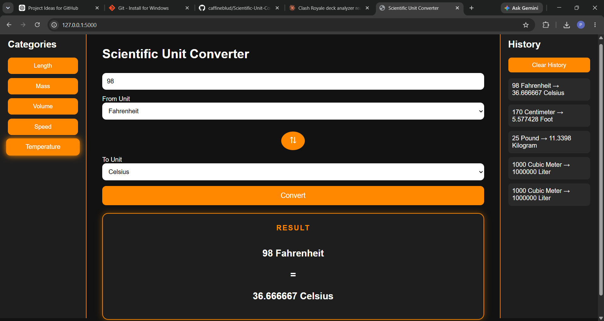

# 🔬 Scientific Unit Converter V2.8


> A polished, dark-themed web converter with persistent history, swap functionality, one-click copy, active category highlighting, full Temperature conversion support, and now a fully responsive layout — usable seamlessly on phones, tablets, and desktops.

---

## 📸 Preview

<p align="center">
  
</p>

---

## 🆕 What's New in V2.8

| # | Feature | Description |
|---|---|---|
| 📱 | **Responsive Layout** | New `@media (max-width: 768px)` breakpoint in `style.css` stacks the sidebar, converter, and history panel vertically (`flex-direction: column`) and switches all three to full width, so the app is usable on phones and tablets, not just desktop |
| ✅ | **V3 Roadmap Progress** | Mobile responsive layout — previously planned for V3 — is now live in V2.8 |

---

## ✨ Previously in V2.7

| # | Feature | Description |
|---|---|---|
| 🌡️ | **Temperature Category** | New 5th category added to the sidebar and dropdowns — Celsius, Fahrenheit, Kelvin |
| 🧮 | **Offset-Based Conversion Logic** | Temperature uses dedicated formula-based conversion (`convert_temperature`) instead of simple factor math, since temperature scales aren't purely multiplicative |

---

## ✨ Previously in V2.5

| # | Feature | Description |
|---|---|---|
| ⇅ | **Swap Button** | Instantly swap From ↔ To units with a single click. Rotates 180° on hover. |
| 📋 | **Copy Result** | One-click clipboard copy with a "Copied!" confirmation that resets after 2s |
| 💾 | **Persistent History** | Conversion history saved to `localStorage` — survives page refresh and browser close |
| 🗑️ | **Clear History** | Wipe the history panel and `localStorage` in one click |
| 🟠 | **Active Category Highlight** | Selected category button glows with an orange box-shadow so you always know where you are |

---

## ✨ Full Feature Set

| Feature | V1 | V2.5 | V2.7 | V2.8 |
|---|:---:|:---:|:---:|:---:|
| 4+ Unit Categories | ✅ | ✅ | ✅ | ✅ |
| Temperature Conversions (°C / °F / K) | ❌ | ❌ | ✅ | ✅ |
| Async Conversion (no reload) | ✅ | ✅ | ✅ | ✅ |
| Session History Panel | ✅ | ✅ | ✅ | ✅ |
| Dark Theme + Orange Accent | ✅ | ✅ | ✅ | ✅ |
| Swap From ↔ To Units | ❌ | ✅ | ✅ | ✅ |
| Copy Result to Clipboard | ❌ | ✅ | ✅ | ✅ |
| Persistent History (localStorage) | ❌ | ✅ | ✅ | ✅ |
| Clear History Button | ❌ | ✅ | ✅ | ✅ |
| Active Category Highlight + Glow | ❌ | ✅ | ✅ | ✅ |
| Responsive Layout (Mobile/Tablet) | ❌ | ❌ | ❌ | ✅ |

---

## 🗂️ Project Structure

```
scientific-unit-converter/
│
├── app.py              # 🚀 Flask server — routes and /convert API endpoint
├── converter.py        # 🧠 Conversion logic, unit registry, and temperature formulas
├── requirements.txt    # 📦 Python dependencies
│
├── templates/
│   └── index.html      # 🏗️  Main layout — swap btn, copy btn, clear history, Temperature category
│
└── static/
    ├── style.css       # 🎨 Swap animation, glow effect, copy & clear btn styles, mobile responsive breakpoint
    └── script.js       # ⚙️  localStorage persistence, swap logic, clipboard API, Temperature units
```

---

## 🛠️ Tech Stack

| Layer | Technology | Purpose |
|---|---|---|
| **Backend** | [Flask](https://flask.palletsprojects.com/) | API routing & Jinja2 template serving |
| **Conversion Engine** | Python | Base-value normalization math + dedicated temperature formulas |
| **Frontend** | HTML5 + CSS3 | Layout, dark theme, button animations, responsive breakpoints |
| **Interactivity** | Vanilla JavaScript (ES6+) | Async fetch, swap, clipboard, localStorage |
| **Persistence** | Web LocalStorage API | History survives refresh & browser close |

---

## 📱 Responsive Design

V2.8 introduces a mobile/tablet breakpoint via a CSS media query:

```css
@media (max-width: 768px) {
    .container {
        flex-direction: column;
    }
    .sidebar, .converter, .history {
        width: 100%;
    }
}
```

Below 768px, the three-column layout (sidebar, converter, history) collapses into a single stacked column, with each section expanding to full width. This keeps the converter fully usable on phones and tablets without any change to the underlying HTML structure.

---

## 🧠 Conversion Engine

Most units are stored relative to a **base unit**. Conversion is a two-step normalization:

```
Input × from_unit_factor
─────────────────────────  =  Result
    to_unit_factor
```

**Temperature is the exception** — since Celsius, Fahrenheit, and Kelvin aren't related by a simple multiplicative factor (they involve offsets), temperature conversions are handled by a dedicated `convert_temperature()` function with explicit formulas for each direction.

### Supported Units

| Category | Base Unit | Units |
|---|---|---|
| 📏 **Length** | Meter | Meter, Kilometer, Centimeter, Millimeter, Inch, Foot, Yard, Mile |
| ⚖️ **Mass** | Kilogram | Kilogram, Gram, Milligram, Pound, Ounce |
| 🧪 **Volume** | Liter | Liter, Milliliter, Cubic Meter, Gallon |
| 💨 **Speed** | m/s | m/s, km/h, mph |
| 🌡️ **Temperature** | — (formula-based) | Celsius, Fahrenheit, Kelvin |

---

## 🌐 API Reference

### `POST /convert`

**Request**
```json
{
    "category": "Mass",
    "value": 25,
    "from_unit": "Pound",
    "to_unit": "Kilogram"
}
```

**Response**
```json
{
    "result": 11.3398
}
```

**Temperature Example**
```json
{
    "category": "Temperature",
    "value": 100,
    "from_unit": "Celsius",
    "to_unit": "Fahrenheit"
}
```

**Response**
```json
{
    "result": 212.0
}
```

---

## ⚙️ Setup & Installation

### Prerequisites
- Python 3.10+
- pip

### Install & Run

```bash
pip install flask
python app.py
```

Open in browser:
```
http://127.0.0.1:5000
```

---

## 🔮 Planned for V3

- [ ] 🔍 Unit search filter in dropdowns
- [ ] 📊 Conversion history chart
- [ ] 🌐 Deploy to Render / Railway

---

## 👨‍💻 Author

**Yash Kumar Singh**

Built with ❤️ — V2.8 adds a fully responsive layout for phones and tablets, building on V2.7's Temperature support and V2.5's UX polish.
