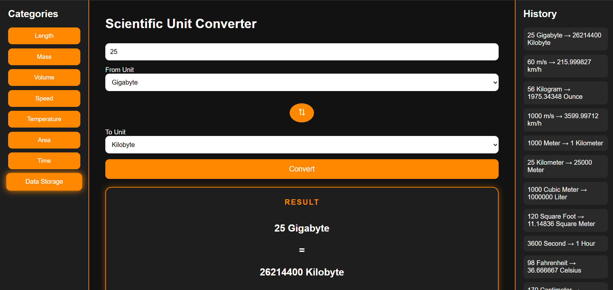
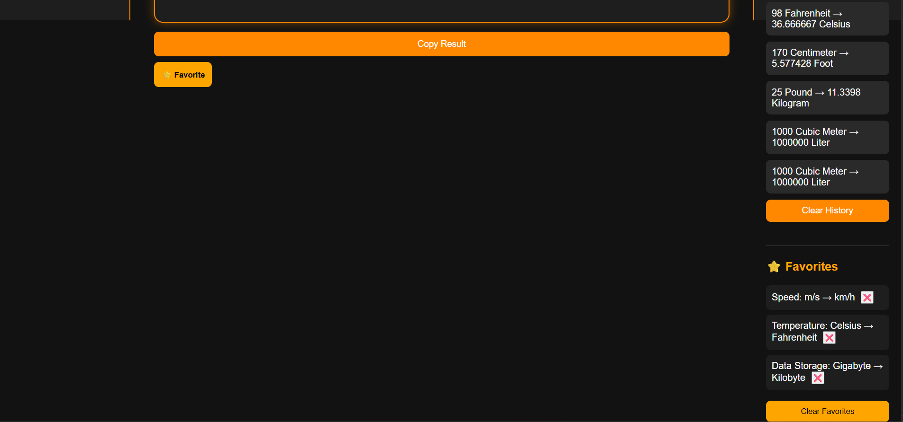

# 🔬 Scientific Unit Converter V3.0

<div align="center">


**A full-featured scientific unit converter — 8 categories, persistent favorites, smart history, and a polished dark UI.**

[](https://github.com/caffineblud/Scientific-Unit-Converter)

</div>

---

## 📸 Preview

<p align="center">
  
</p>

<p align="center">
  
</p>

---

## 🆕 What's New in V3.0

> V3.0 upgrades the app from a **one-time converter** into a **reusable conversion workspace** with a complete Favorites system.

| # | Feature | Details |
|---|---|---|
| ⭐ | **Save Favorites** | Save any category + From + To combination with one click |
| 💾 | **Persistent Favorites** | Stored in `localStorage` — survive refresh, tab close, and browser restart |
| ⚡ | **Click-to-Autofill** | Click any favorite to instantly load its category and units — no manual setup |
| ❌ | **Delete Individual Favorites** | Each entry has its own ❌ button — removes only that item via `splice(index, 1)` |
| 🗑️ | **Clear All Favorites** | Wipes the panel and calls `localStorage.removeItem("favorites")` in one click |
| 🎨 | **Result Card Redesign** | Result now renders in a bordered orange-glow card with centered `input = output` layout |
| 📐 | **Dual-Panel Right Sidebar** | History and Favorites now live in the same sidebar, separated by a divider |

---

## 📋 Changelog — Full Version History

| Feature | V1 | V2.5 | V2.7 | V2.8 | V2.9 | V3.0 |
|---|:---:|:---:|:---:|:---:|:---:|:---:|
| Core Conversion (4 categories) | ✅ | ✅ | ✅ | ✅ | ✅ | ✅ |
| Async Fetch (no page reload) | ✅ | ✅ | ✅ | ✅ | ✅ | ✅ |
| Dark Theme + Orange Accent | ✅ | ✅ | ✅ | ✅ | ✅ | ✅ |
| Session History Panel | ✅ | ✅ | ✅ | ✅ | ✅ | ✅ |
| Swap From ↔ To (⇅ button) | ❌ | ✅ | ✅ | ✅ | ✅ | ✅ |
| Copy Result to Clipboard | ❌ | ✅ | ✅ | ✅ | ✅ | ✅ |
| Persistent History (localStorage) | ❌ | ✅ | ✅ | ✅ | ✅ | ✅ |
| Clear History Button | ❌ | ✅ | ✅ | ✅ | ✅ | ✅ |
| Active Category Glow Highlight | ❌ | ✅ | ✅ | ✅ | ✅ | ✅ |
| Temperature (°C / °F / K) | ❌ | ❌ | ✅ | ✅ | ✅ | ✅ |
| Responsive Layout (≤768px) | ❌ | ❌ | ❌ | ✅ | ✅ | ✅ |
| Area / Time / Data Storage | ❌ | ❌ | ❌ | ❌ | ✅ | ✅ |
| Save Favorite Conversions | ❌ | ❌ | ❌ | ❌ | ❌ | ✅ |
| Persistent Favorites | ❌ | ❌ | ❌ | ❌ | ❌ | ✅ |
| Click-to-Autofill Favorites | ❌ | ❌ | ❌ | ❌ | ❌ | ✅ |
| Delete Individual Favorites | ❌ | ❌ | ❌ | ❌ | ❌ | ✅ |
| Clear All Favorites | ❌ | ❌ | ❌ | ❌ | ❌ | ✅ |
| Result Card with Orange Glow | ❌ | ❌ | ❌ | ❌ | ❌ | ✅ |

---

## 🗂️ Project Structure

```
Scientific-Unit-Converter/
│
├── app.py                   # 🚀 Flask server — home route + /convert POST endpoint
├── converter.py             # 🧠 Unit registry (UNITS dict) + convert_unit() + convert_temperature()
├── requirements.txt         # 📦 Python dependencies
│
├── templates/
│   └── index.html           # 🏗️  8 category buttons, swap, convert, copy, favorite, dual sidebar
│
└── static/
    ├── style.css            # 🎨 Result card glow, favorites panel, responsive breakpoint
    └── script.js            # ⚙️  Favorites CRUD, autofill, localStorage, swap, clipboard, history
```

---

## 🛠️ Tech Stack

| Layer | Technology | Role |
|---|---|---|
| **Backend** | Python + Flask | Serves HTML via Jinja2, handles `/convert` POST requests |
| **Conversion Engine** | Python (`converter.py`) | Factor-based math for 7 categories + formula-based temperature |
| **Frontend** | HTML5 + CSS3 | 3-column layout, orange-glow UI, responsive media query |
| **Logic & Interactivity** | Vanilla JS (ES6+) | Async fetch, favorites CRUD, swap, clipboard API, localStorage |
| **Persistence** | Web LocalStorage API | Both history and favorites survive across sessions |

---

## ⭐ Favorites System — Deep Dive

### How Save Works
```javascript
// On clicking ⭐ Favorite
const favorite = {
    category: currentCategory,          // e.g. "Temperature"
    from: document.getElementById("from-unit").value,  // e.g. "Celsius"
    to: document.getElementById("to-unit").value        // e.g. "Fahrenheit"
};
favorites.push(favorite);
localStorage.setItem("favorites", JSON.stringify(favorites));
```

### Click-to-Autofill
```javascript
// Clicking a favorite entry in the panel
li.addEventListener("click", () => {
    currentCategory = fav.category;
    updateDropdowns(currentCategory);
    document.getElementById("from-unit").value = fav.from;
    document.getElementById("to-unit").value = fav.to;
});
```

### Delete & Clear
```javascript
// Delete one
favorites.splice(index, 1);
localStorage.setItem("favorites", JSON.stringify(favorites));

// Clear all
localStorage.removeItem("favorites");
```

---

## 🧠 Conversion Engine — `converter.py`

### Factor-Based (7 categories)
All units stored relative to a base unit. Conversion is two-step normalization:

```
Result = (value × from_factor) ÷ to_factor
```

### Formula-Based (Temperature only)
Temperature uses dedicated formulas since °C, °F, and K aren't multiplicatively related:

```python
# Celsius → Fahrenheit        (value × 9/5) + 32
# Celsius → Kelvin            value + 273.15
# Fahrenheit → Celsius        (value − 32) × 5/9
# Fahrenheit → Kelvin         ((value − 32) × 5/9) + 273.15
# Kelvin → Celsius            value − 273.15
# Kelvin → Fahrenheit         ((value − 273.15) × 9/5) + 32
```

### All Supported Units

| Category | Base Unit | Units |
|---|---|---|
| 📏 **Length** | Meter | Meter, Kilometer, Centimeter, Millimeter, Inch, Foot, Yard, Mile |
| ⚖️ **Mass** | Kilogram | Kilogram, Gram, Milligram, Pound, Ounce |
| 🧪 **Volume** | Liter | Liter, Milliliter, Cubic Meter, Gallon |
| 💨 **Speed** | m/s | m/s, km/h, mph |
| 🌡️ **Temperature** | — (formula) | Celsius, Fahrenheit, Kelvin |
| 📐 **Area** | Square Meter | Square Meter, Square Kilometer, Square Foot, Square Inch, Acre |
| ⏱️ **Time** | Second | Second, Minute, Hour, Day |
| 💾 **Data Storage** | Byte (binary) | Byte, Kilobyte (1024), Megabyte (1024²), Gigabyte (1024³), Terabyte (1024⁴) |

> **Note:** Data Storage uses binary prefixes (1 KB = 1024 B), not decimal (1000 B).

---

## 🌐 API Reference

### `POST /convert`

**Standard Request**
```json
{
    "category": "Data Storage",
    "value": 25,
    "from_unit": "Gigabyte",
    "to_unit": "Kilobyte"
}
```
```json
{ "result": 26214400.0 }
```

**Temperature Request**
```json
{
    "category": "Temperature",
    "value": 98,
    "from_unit": "Fahrenheit",
    "to_unit": "Celsius"
}
```
```json
{ "result": 36.666667 }
```

---

## 📱 Responsive Design

Below `768px`, the three-column layout collapses into a single stacked column:

```css
@media (max-width: 768px) {
    .container { flex-direction: column; }
    .sidebar, .converter, .history { width: 100%; }
}
```

---

## ⚙️ Setup & Installation

```bash
# Clone the repo
git clone https://github.com/caffineblud/Scientific-Unit-Converter.git
cd Scientific-Unit-Converter

# Install dependencies
pip install flask

# Run
python app.py
```

```
http://127.0.0.1:5000
```

---

## 🔮 Planned for V3.x

- [ ] 🔍 Unit search filter in dropdowns
- [ ] 📊 Visual history chart
- [ ] 📄 Export history to CSV
- [ ] 🌐 Deploy to Render / Railway

---

## 👨‍💻 Author

<div align="center">

**Yash Kumar Singh**

[](https://github.com/caffineblud)
[](https://linkedin.com/in/yash-kumar-singh-8a4b193b1)

*Built with ❤️ — V3.0 makes the converter a workspace you actually want to come back to.*

</div>